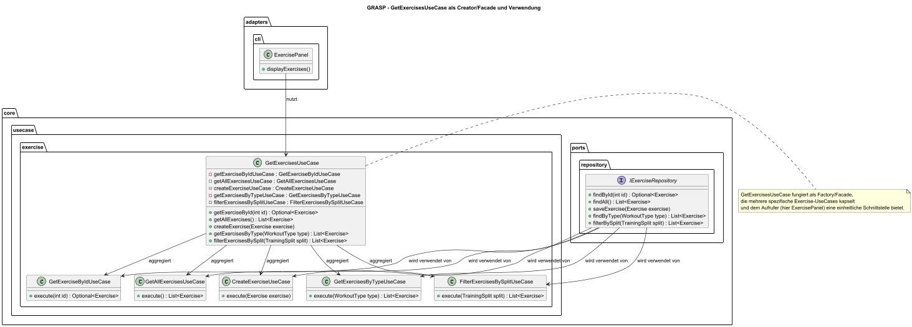

# Programmentwurf - Protokoll

**Name:** [Obreiter, Nick]
**Matrikelnummer:** [8107127]
**Abgabedatum:** [DATUM]

# Kapitel 1: Einführung (4P)

## Übersicht über die Applikation (1P)

```
[Was macht die Applikation? Wie funktioniert sie? 
Welches Problem löst sie/welchen Zweck hat sie?]
```

**FitTrackerPro** ist eine prototyp zur Erfassung und generieung von
Workouts. Es wird dem Nutern ermöglicht Trainingspläne zu erstellen,
Fortschritte zu verfolgen und in Zukunft Ernährungsdaten zu verwalten.

---

## Starten der Applikation (1P)

```
[Wie startet man die Applikation?
Was für Voraussetzungen werden benötigt?
Schritt-für-SchrittAnleitung]
```

Die Applikation kann mit dem normalen Java-Befehl in der Konsole
ausgeführt werden:

```bash
  java -jar FitTrackerPro.jar
```

Voraussetzungen:

- Installierte Java-Laufzeitumgebung version 21 (JRE) oder
  Java Development Kit (JDK)
- Das `FitTrackerPro.jar`-File muss sich im aktuellen Verzeichnis
  befinden.

---

## Technischer Überblick (2P)

```
[Nennung und Erläuterung der Technologien
(z.B. Java, MySQL, …), jeweils Begründung für den
Einsatz der Technologien]
```

FitTrackerPro ist eine Java-basierte Anwendung,
die mit **Maven** als Build-Tool verwaltet wird.
Die wichtigsten Technologien sind:

- **Java 21**: Verwendet für die Kernentwicklung aufgrund der verbesserten Performance und Features.
- **Maven**: Verwaltung von Abhängigkeiten und Build-Prozess.
- **H2-Datenbank**: Vorbereitung für einsatz von Datenpersistenz sofern man keine InMemoryVerwendet.
- **JUnit**: Testframework für Unit-Tests.
- **PlantUML-Generator**: Automatische Erstellung von UML-Diagrammen zur Code-Dokumentation.
- **Commons-IO**: Bibliothek für erweiterte Dateioperationen (benötigt für PlantUML.
- Ververwendung von SonarCube

---

# Kapitel 2: Softwarearchitektur (8P)

## Gewählte Architektur (4P)

```
[In der Vorlesung wurden Softwarearchitekturen vorgestellt.
 Welche Architektur wurde davon umgesetzt?
 Analyse und Begründung inkl. UML der wichtigsten Klassen,
 sowie Einordnung dieser Klassen in die gewählte Architektur]
```

## **Gewählte Architektur: Clean Architecture**

### Clean Architecture

- **Schichten:**

  1. **Domain (Entities):** Enthält zentrale Domänenobjekte wie `Exercise`, `User` und `Workout`.
  2. **Use Cases:** Realisieren Geschäftsprozesse, z. B. `CreateWorkoutUseCase` oder `AuthenticationUserUseCase`.
  3. **Interface Adapters:** Übersetzen Daten zwischen interner Logik und externen Schnittstellen.
- **Dependency Rule:**
  Alle Abhängigkeiten verlaufen von außen nach innen, sodass die inneren Schichten (Domain und Use Cases) keine Kenntnis
  von technischen Implementierungen haben.

---

## Domain Code (1P)

```
[kurze Erläuterung in eigenen Worten, was Domain Code ist 
– 1 Beispiel im Code zeigen, das bisher noch nicht gezeigt wurde]
```

- Im Kontext von Domain-Driven Design (DDD) und Clean Architecture bildet der "Domain Code" den fachlichen Kern der
  Anwendung. Er beinhaltet alle Komponenten, die die Geschäftsdomäne modellieren – also die zentralen Konzepte, Regeln
  und
  Eigenschaften.

```java
package core.domain.exercise;

import java.util.List;

public record Exercise(
        int id,
        String name,
        ExerciseCategory category,
        Difficulty difficulty,
        String description,
        List<MuscleGroup> targetMuscles
) implements Comparable<Exercise>
{
    @Override
    public int compareTo(Exercise other)
    {
        return this.name.compareTo(other.name);
    }
}
```

---

## Analyse der Dependency Rule (3P)

```
[In der Vorlesung wurde im Rahmen der ‘Clean Architecture’ die s.g. Dependency Rule vorgestellt. Je 1
Klasse zeigen, die die Dependency Rule einhält und 1 Klasse, die die Dependency Rule verletzt;
jeweils UML (mind. die betreffende Klasse inkl. der Klassen, die von ihr abhängen bzw. von der sie
abhängt) und Analyse der Abhängigkeiten in beide Richtungen (d.h., von wem hängt die Klasse ab und
wer hängt von der Klasse ab) in Bezug auf die Dependency Rule]

```

### Positiv-Beispiel: Dependency Rule

- **Abhängigkeiten von:**
  `ServiceFactory` hängt von abstrakten Schnittstellen (Interfaces) ab, nicht von konkreten Klassen.
- **Abhängigkeiten zu:**
  Hohe Schichten (z. B. Use Cases) greifen über die Factory auf diese Schnittstellen zu – ohne direkten Bezug zu den
  konkreten Implementierungen.
- **Fazit:**
  Die Klasse folgt der Dependency Rule, da alle Abhängigkeiten von außen (über die Interfaces) nach innen fließen.

### Negativ-Beispiel: Dependency Rule

---

# Kapitel 3: SOLID (8P)

## Analyse SRP (3P)

```
[jeweils eine Klasse als positives und negatives Beispiel für SRP; jeweils UML und Beschreibung der
Aufgabe bzw. der Aufgaben und möglicher Lösungsweg des Negativ-Beispiels (inkl. UML)]
```

### Positiv-Beispiel


### Negativ-Beispiel


-------------------------------------------------------------------

## Analyse OCP (3P)

```
[jeweils eine Klasse als positives und negatives Beispiel für OCP; jeweils UML und Analyse mit
Begründung, warum das OCP erfüllt/nicht erfüllt wurde – falls erfüllt: warum hier sinnvoll/welches
Problem gab es? Falls nicht erfüllt: wie könnte man es lösen (inkl. UML)?]
```

### Positiv-Beispiel

Die Klasse `SHA256PasswordHasher` implementiert das Interface `IPasswordHasher`.
Wird ein neuer Hashing-Algorithmus benötigt, kann eine neue Klasse implementiert werden, ohne dass bestehender Code
verändert werden muss.


### Negativ-Beispiel

Die ursprüngliche Implementierung der Klasse `SmarterWorkoutGenerator` enthält in sich mehrere private Methoden (z. B.
`getFullBodyWorkout`, `getUpperLowerWorkout`, `getPushPullLegWorkout`), die fest kodierte Logiken zur Generierung
verschiedener Workout-Typen beinhalten.

**Analyse:**
Möchte man einen neuen Workout-Typ hinzufügen, muss die Klasse direkt geändert werden (z. B. durch Hinzufügen neuer
Methoden oder Anpassen der switch/case-Logik). Dadurch ist die Klasse nicht geschlossen für Änderungen, sondern muss
modifiziert werden, was gegen das OCP verstößt.


---

## Analyse [LSP/ISP/DIP] (2P)

```
[jeweils eine Klasse als positives und negatives Beispiel für entweder LSP oder ISP oder DIP; jeweils
UML und Begründung, warum hier das Prinzip erfüllt/nicht erfüllt wird; beim Negativ-Beispiel UML
einer möglichen Lösung hinzufügen]
[Anm.: es darf nur ein Prinzip ausgewählt werden; es darf NICHT z.B. ein positives Beispiel für LSP
und ein negatives Beispiel für ISP genommen werden]
```

### Positiv-Beispiel


### Negativ-Beispiel

--todo
TODO
----

# Kapitel 4: Weitere Prinzipien (8P)

## Analyse GRASP: Geringe Kopplung (3P)

```
[eine bis jetzt noch nicht behandelte Klasse als positives Beispiel geringer Kopplung; UML mit
zusammenspielenden Klassen, Aufgabenbeschreibung der Klasse und Begründung, warum hier eine
geringe Kopplung vorliegt; es müssen auch die Aufrufer/Nutzer der Klasse berücksichtigt werden]
```



Beschreibung:
Der GetExercisesUseCase übernimmt in diesem Beispiel die Rolle einer Factory bzw. Fassade, indem er in seinem
Konstruktor alle spezifischen Exercise-UseCases (wie GetExerciseByIdUseCase, GetAllExercisesUseCase, etc.)
initialisiert. Dadurch wird dem aufrufenden Element – hier einem beispielhaften ExercisePanel – eine einheitliche
Schnittstelle bereitgestellt, um unterschiedliche Operationen (Abrufen, Erstellen, Filtern) durchzuführen.

Begründung:

Geringe Kopplung: Das ExercisePanel muss sich nicht um die Details der einzelnen Exercise-UseCases kümmern, sondern
nutzt lediglich die über den GetExercisesUseCase bereitgestellten Methoden.

Creator/Facade-Prinzip: GetExercisesUseCase ist verantwortlich für die Erstellung und Aggregation der spezifischen Use
Cases, was den Creator-Grundsatz aus GRASP widerspiegelt.

Wartbarkeit und Erweiterbarkeit: Änderungen in einem der spezifischen Use Cases wirken sich nicht direkt auf die
Aufrufer aus, da der GetExercisesUseCase als zentrale Schnittstelle fungiert.

---

## Analyse GRASP: [Polymorphismus/Pure Fabrication] (3P)

```
[eine Klasse als positives Beispiel entweder von Polymorphismus oder von Pure Fabrication; UML
Diagramm und Begründung, warum es hier zum Einsatz kommt]
```


Die abstrakte Klasse AbstractConsolePanel legt grundlegende Funktionen (z. B. handleInput, addMenuAction,
removeMainMenu, exitPanel) für alle Konsolen-Panels fest. Konkrete Panels wie LoginPanel und MainMenuPanel erben von
AbstractConsolePanel und implementieren die abstrakte Methode showPanel().

---

## DRY (2P)

```
[ein Commit angeben, bei dem duplizierter Code/duplizierte Logik aufgelöst wurde; Code-Beispiele
(vorher/nachher) einfügen; begründen und Auswirkung beschreiben – ggf. UML zum Verständnis
ergänzen]
```

---

# Kapitel 5: Unit Tests (8P)

## 10 Unit Tests (2P)

```
[Zeigen und Beschreiben von 10 Unit-Tests und Beschreibung, was getestet wird]
```

---

## ATRIP: Automatic, Thorough und Professional (2P)

```
[je Begründung/Erläuterung, wie ‘Automatic’, ‘Thorough’ und ‘Professional’ realisiert wurde – bei
‘Thorough’ zusätzlich Analyse und Bewertung zur Testabdeckung]
```

---

## Fakes und Mocks (4P)

```
[Analyse und Begründung des Einsatzes von 2 Fake/Mock-Objekten (die Fake/Mocks sind ohne
Dritthersteller-Bibliothek/Framework zu implementieren); zusätzlich jeweils UML Diagramm mit
Beziehungen zwischen Mock, zu mockender Klasse und Aufrufer des Mocks]
```

---

# Kapitel 6: Domain Driven Design (8P)

## Ubiquitous Language (2P)

```
[4 Beispiele für die Ubiquitous Language; jeweils Bezeichung, Bedeutung und kurze Begründung,
warum es zur Ubiquitous Language gehört]
```


| Bezeichnung       | Bedeutung                                                                       | Begründung                                                                                                                                     |
| ----------------- | ------------------------------------------------------------------------------- | ----------------------------------------------------------------------------------------------------------------------------------------------- |
| **User**          | Repräsentiert einen Endnutzer der Applikation                                  | Der Begriff „User“ wird durchgängig verwendet, um Personen zu bezeichnen, die Workouts planen und ausführen.                                |
| **Workout**       | Eine Trainingseinheit oder -einheiten, die dem Nutzer zugeordnet sind           | „Workout“ beschreibt präzise die Kerndaten und Aktionen im System, etwa zur Trainingsplanung.                                                |
| **Exercise**      | Eine einzelne Übung, die Teil eines Workouts sein kann                         | Der Begriff hebt die feinere Granularität innerhalb eines Workouts hervor und fördert ein gemeinsames Verständnis der Trainingsbestandteile. |
| **TrainingSplit** | Eine Aufteilung oder Strukturierung der Übungen innerhalb eines Trainingsplans | „TrainingSplit“ beschreibt, wie Übungen auf verschiedene Trainingstage verteilt werden – ein zentraler Aspekt in der Fitness-Domain.        |

---

## Repositories (1,5P)

```
[UML, Beschreibung und Begründung des Einsatzes eines Repositories; falls kein Repository
vorhanden: ausführliche Begründung, warum es keines geben kann/hier nicht sinnvoll ist – NICHT,
warum es nicht implementiert wurde]
```


Beschreibung:
Das Repository kapselt den Datenzugriff auf Workouts.
Das Interface IWorkoutRepository definiert die Operationen zum Speichern,
Abrufen und Löschen von Workouts.
InMemoryWorkoutRepository ist eine konkrete, in-Memory-Implementierung.

Begründung:

Entkopplung: Die Geschäftslogik muss sich nicht um die Persistenz kümmern.

Testbarkeit: Leicht austauschbar (z. B. durch Mocks).
Wartbarkeit: Änderungen im Datenzugriff erfordern nur Anpassungen im Repository.

---

## Aggregates (1,5P)

```
[UML, Beschreibung und Begründung des Einsatzes eines Aggregates; falls kein Aggregate
vorhanden: ausführliche Begründung, warum es keines geben kann/hier nicht sinnvoll ist– NICHT,
warum es nicht implementiert wurde]
```

Beschreibung:
Das Aggregate besteht im Beispiel aus dem Workout-Record, das alle zugehörigen TrainingDays und damit auch deren
Exercises umfasst. Es fasst mehrere zusammengehörige Elemente zu einer konsistenten Einheit zusammen.

Begründung:

Konsistenz: Änderungen innerhalb eines Aggregates (z. B. das Hinzufügen oder Entfernen von TrainingDays) werden als
zusammenhängende Einheit behandelt.

Transaktionsgrenzen: Das Aggregate definiert klare Grenzen, innerhalb derer Datenintegrität gewährleistet werden kann.

Domain Driven Design: Aggregates unterstützen die Modellierung der Domain, indem sie komplexe Zusammenhänge vereinfachen
und einen zentralen Zugriffspunkt bieten.


---

## Entities (1,5P)

```
[UML, Beschreibung und Begründung des Einsatzes einer Entity; falls keine Entity vorhanden:
ausführliche Begründung, warum es keine geben kann/hier nicht sinnvoll ist– NICHT, warum es nicht
implementiert wurde]
```


Beschreibung:
Die Entity User repräsentiert einen Endnutzer in der Domain. Sie besitzt eine eindeutige ID und weitere Attribute wie
Username, Password und Email.

Begründung:

Identität: Als Entity wird der User durch seine ID eindeutig identifiziert.

Veränderbarkeit: Eigenschaften wie das Passwort oder die Email können im Laufe der Zeit angepasst werden, ohne dass sich
die Identität des Users ändert.

---

## Value Objects (1,5P)

```
[UML, Beschreibung und Begründung des Einsatzes eines Value Objects; falls kein Value Object
vorhanden: ausführliche Begründung, warum es keines geben kann/hier nicht sinnvoll ist– NICHT,
warum es nicht implementiert wurde]
```


Das Value Object Birthday repräsentiert ein Geburtsdatum. Es enthält ein Datum und bietet eine Methode, um das
Datum formatiert zurückzugeben.

Begründung:

Unveränderlichkeit: Ein Value Object wie Birthday ändert sich nicht, sondern wird bei Bedarf komplett ersetzt.

Keine eigene Identität: Im Gegensatz zu Entitäten wird Birthday allein durch seinen Wert bestimmt.

Konsistente Verwendung: Es sorgt für eine einheitliche Darstellung des Geburtsdatums in der gesamten Domain.
-------------------------------------------------------------------------------------------------------------

# Kapitel 7: Refactoring (8P)

## Code Smells (2P)

```
[jeweils 1 Code-Beispiel zu 2 unterschiedlichen Code Smells (die benannt werden müssen) aus der
Vorlesung; jeweils Code-Beispiel und einen möglichen Lösungsweg bzw. den genommen Lösungsweg
beschreiben (inkl. (Pseudo-)Code)]
```

---

## 2 Refactorings (6P)

```
[2 unterschiedliche Refactorings aus der Vorlesung jeweils benennen, anwenden, begründen, sowie
UML vorher/nachher liefern; jeweils auf die Commits verweisen – die Refactorings dürfen sich nicht
mit den Beispielen der Code überschneiden]
```

---

# Kapitel 8: Entwurfsmuster (8P)
